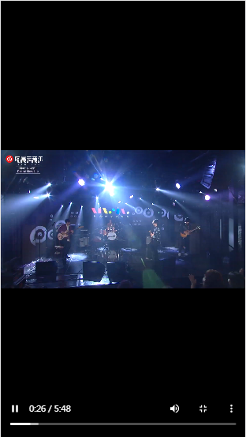

# YFMusic

## 灵感来自
[NeteaseCloudMusicApi](https://github.com/Binaryify/NeteaseCloudMusicApi)
[NeteaseCloudMusicApi](https://github.com/Binaryify/NeteaseCloudMusicApi) 前往下载并运行Node.js API 运行3000端口

## 功能列表

1.推荐歌单
2.搜索单曲
3.主题播放器
4.播放队列
5.歌词滚动
6.播放进度条
7.Mv播放

## 环境要求

需要 NodeJS 8.12+ 环境

## 安装

```shell
$ npm install
```

## 运行

```shell
$ npm run serve
```

## 项目截图
<div  align="center">    
  <br/>  
  <br/>  
  <br/>  
  <br/>  
  <br/>  
  <br/>  
  <br/>  
</div>
 


